Instrukcja obsługi oprogramowania Arduino Digital Clock
=======================================================

Kontrola nad urządzeniem
------------------------
System kontroli urządzenia obejmuje następujące przyciski:

* ON/OFF
* Analogowe: ``UP``, ``DOWN``, ``RIGHT``, ``SELECT``
* Cyfrowe: ``ALARM``

Ekran główny
------------

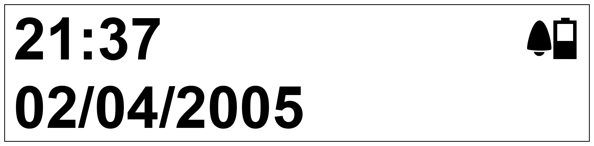

Podczas pierwszego uruchomienia urządzenia pokaże nam się powyższy ekran. Jest to ekran główny, który domyślnie pokazuje aktualną godzinę, datę oraz status baterii. Po 60 sekundach bezczynności urządzenie przechodzi w tryb niskiego poboru energii. Wybudzić go może naciśnięcie przycisku ``ALARM``.

Kontrola:

* ``SELECT`` - Wejdź do Menu.
* ``ALARM`` - Wybudź urządzenie

Menu główne
-----------
Po przyciśnięciu przycisku ``SELECT`` na ekranie głównym przechodzimy do menu główngo programu. Z tego poziomu mamy dostępne następujące opcje:

* Ustaw godzinę
* Ustaw datę
* Alarmy
* Status baterii
* O programie

Kontrola:

* ``UP`` - Przejdź poziom do góry
* ``RIGHT`` - Przejdź do kolejnego elementu w Menu
* ``SELECT`` - Zatwierdź wybór

Ustaw godzinę
-------------

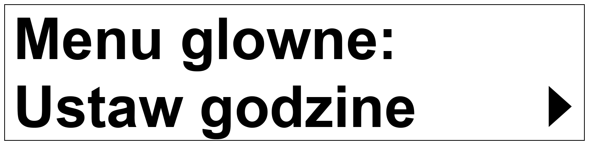

Po wybraniu tej opcji przyciskiem ``SELECT`` będziemy mogli tutaj ustawić czas. Za pomocą przycisów ``UP`` i ``DOWN`` ustawiamy odpowiednią godzinę. naciskając przycisk ``RIGHT`` wybieramy modyfikowany element - godzinę lub minutę. O wybranym elemencie informuje migający kursor. Wybór zatwierdzamy przyciskiem ``SELECT``. Zostaniemy przekierowani do okna zapisu, które jest opisane niżej.

Kontrola:

* ``UP`` - Zwiększ wartość elementu
* ``DOWN`` - Zmniejsz wartość elementu
* ``RIGHT`` - Przejdź do następnego elementu
* ``SELECT`` - Zatwierdź i przejdź do ekranu zapisu

Ustaw datę
----------

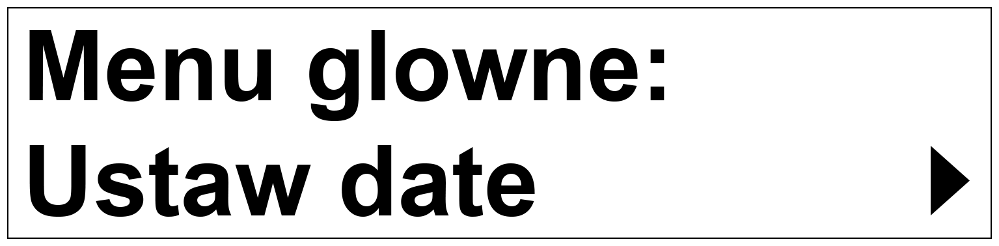

W tym oknie aktualną datę. Program automatycznie dobiera ilość dni w zależności od miesiąca, oraz uwzględnia lata przestępne. Obsługiwany zakres lat to 2000 - 2099. Za pomocą przycisków ``UP`` i ``DOWN`` ustawiamy odpowiednią wartość dla wybranego elementu. Za pomocą przycisku ``RIGHT`` przechodzimy pomiedzy elementami. Wybór elementu sygnalizuje migający kursor. Przycisk ``SELECT`` Zatwierdza wybrane ustawienie i przechodzi do ekranu zapisu.

.. image:: _static/setDate.png
   :align: center

Kontrola:

* ``UP`` - Zwiększ wartość elementu
* ``DOWN`` - Zmniejsz wartość elementu
* ``RIGHT`` - Zrzejdź do następnego elementu
* ``SELECT`` - Zatwierdź i przejdź do ekranu zapisu

Alarmy
------

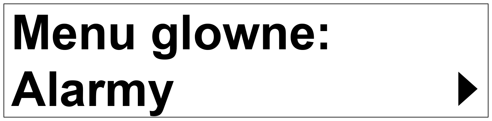

Osobne podmenu zawierające pola dot. ustawiania i wyświetlania alarmów:

* Ustaw alarm
* Włącz/Wyłącz alarm

Kontrola:

* ``UP`` - Przejdź poziom do góry
* ``RIGHT`` - Przejdź do kolejnego elementu w Menu
* ``SELECT`` - Zatwierdź wybór

Ustaw alarm
-----------

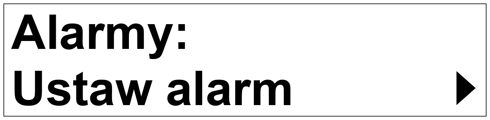

Sekcja *Ustaw alarm* dzieli się na dwie części: Menu wyboru alarmu do ustawienia, oraz ustawienie wybranego alarmu. W menu wybieramy jeden z trzech alarmów, który chcemy zmodyfikować za pomocą przycisków ``RIGHT`` i ``SELECT``. Dodatkowo W tym menu przycisk ``UP`` przenosi nas poziom do góry.

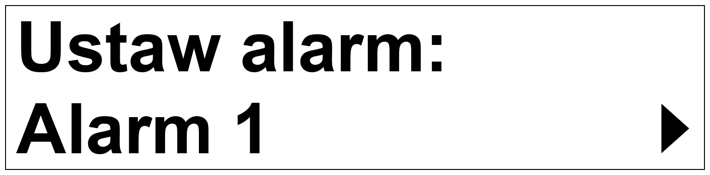

Kontrola:

* ``UP`` - Przejdź poziom do góry
* ``RIGHT`` - Przejdź do kolejnego elementu w Menu
* ``SELECT`` - Zatwierdź wybór

Po wybraniu preferowanej opcji w Menu *Ustaw alarm* pojawi się ekran edycji alarmu. W tym miejscu możemy zmodyfikować godzinę wywołania alarmu przyciskami ``UP``, ``DOWN``, ``RIGHT`` tak samo jak to miało miejsce w przypadku ustawienia godziny zegarka. Dodatkowo przycisk ``ALARM`` ustawia alarm jako włączony lub nie, co sygnalizuje ikona **Dzwonka** w prawym górnym rogu ekranu. Przycisk ``SELECT`` przenosi nas do ekranu zapisu.

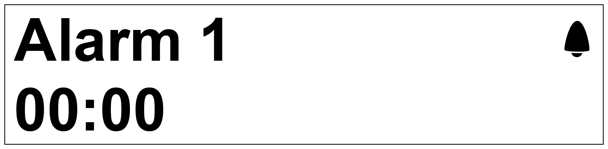

Kontrola:

* ``UP`` - Zwiększ wartość elementu
* ``DOWN`` - Zmniejsz wartość elementu
* ``RIGHT`` - Przejdź do następnego elementu
* ``SELECT`` - Zatwierdź i przejdź do ekranu zapisu
* ``ALARM`` - Włącz/Wylącz alarm

Włącz/Wyłącz alarm
------------------

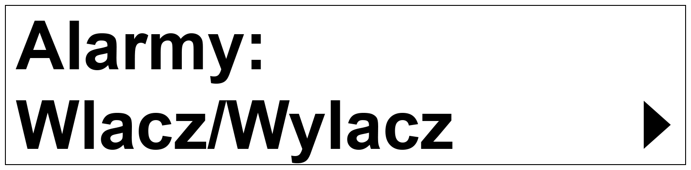

Menu to pokazuje informacje dla aktualnie ustawionych alarmów. Za pomocą przycisku ``RIGHT`` przechodzimy pomiędzy alarmami. Przycisk ``ALARM`` włącza lub wyłącza wybrany alarm co sygnalizuje ikona **Dzwonka** w prawym górnym rogu ekranu. przycisk ``SELECT`` wychodzi z okna.

Kontrola:

* ``RIGHT`` - Przejdź pomiędzy alarmami
* ``ALARM`` - Włącz/Wyłącz wybrany alarm
* ``SELECT`` - Wyjdź z ekranu

Status baterii
--------------

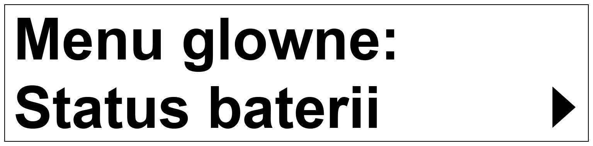

Ekran baterii pokazuje aktualne informacje na temat zainstalowanej baterii. Urządzenie jest przystosowane do działania z bateriami AA alkaline.
Na ekranie widoczne są informacje o Aktualnym napięciu baterii, szacowanym poziomie baterii w procentach, oraz graficzne przedstawienie pojemności baterii.
Przycisk ``UP`` kieruje nas do poprzedniego ekranu.

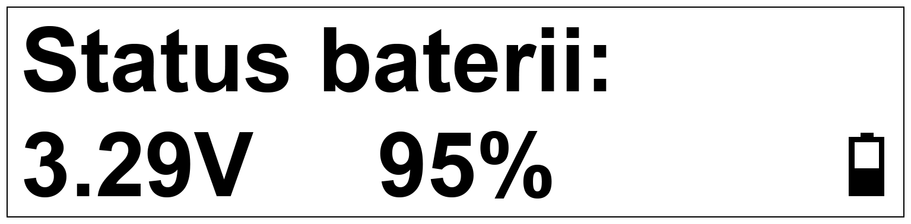

Kontrola:

* ``UP`` - Przejdź poziom do góry, wyjdź

O programie
-----------

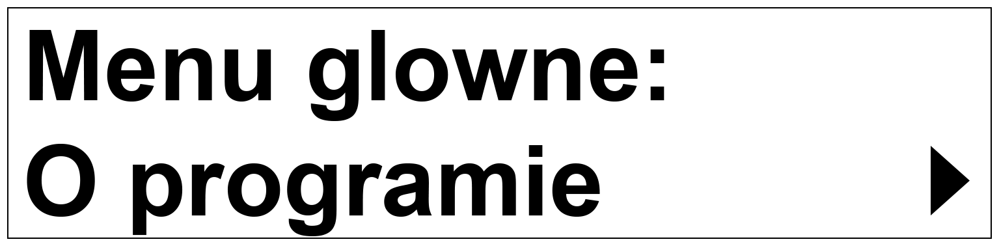

Menu zawiera informacje o oprogramowaniu, dacie kompilacji i autorze.

Kontrola:

* brak

Ekran Zapisz
-----------

.. image:: _static/save.png
   :align: center

Ekran ten pojawia sie po zatwierdzeniu każdej edycji godziny, daty, lub jednego z alarmów. O poprawnym zapisie danych informuje ikona **Serca** w prawym górnym rogu ekranu.

Kontrola:

* ``RIGHT`` - Wybierz jeden z elementów
* ``SELECT`` - Zatwierdź wybór i zapisz

Działanie alarmu
----------------
Jeżeli zegarek dojdzie do godziny ustawionej na jednym z trzech alarmów zegarek włączy melodię polifoniczną i będzie ją odtwarzać dopóki nie zostanie wciśnięty przycisk ``ALARM``. W tym czasie na ekranie pojawia się informacja, który alarm uruchomił sekwencję. Po przyciśnięciu przycisku ``ALARM`` zegarek wyłączy wywołany alarm i wróci do normalnego działania.
